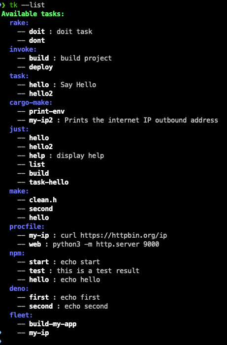

Task Keeper
=================
tk(Task Keeper) is a tool to manage tasks from different task files,
such as `Makefile`,`justfile`, `package.json` , `deno.json`, `.fleet/run.json` etc.,
and call tasks from different project management tools,
such as `Apache Maven`, `Gradle`, `Cargo` and `npm` etc.



**Bonus**: sq(Squirrel) is a command-line snippets keeper to manage cli snippets.

# Features

* List tasks from different task files: `tk --list`
* Invoke task: `tk task_name`
* Invoke task from a runner: `tk --runner=npm start`
* Sync tasks between sources: `tk --from=npm --to=fleet task1 task2`
* .env and [dotenvx](https://dotenvx.com/) support by default: `tk --no-dotenv` to disable
* `--doctor` support: check your system for potential problems to run tasks
* Execute command line: `tk -- node hello.js` with a correct language version and PATH
* Notification: save task output to OSS or send notification to NATS server

# How to get started?

* Install by cargo: `cargo install task-keeper` (or `cargo binstall task-keeper`)
* Using [nix](https://nix.dev/):
    * try without installing: `nix shell github:linux-china/task-keeper`
    * install: e.g. `nix profile install github:linux-china/task-keeper`
* Download pre-built binary from [GitHub Releases](https://github.com/linux-china/task-keeper/releases)

After installation, execute `tk --help` for usage. Some commands as following:

* list tasks: `tk --list`
* execute task: `tk task_name`

# Why task keeper?

Sorry, I got lost in different task files and management tools, and sometimes I even cannot remember how to run them.

* Find tasks: `Makefile`,`justfile`, `package.json`, `deno.json`, `Taskfile.yml`, `tasks.py`, `README.md` etc., and
  too many task files to check tasks.
* Run task: `just taskName`, `npm run task_name`, `deno task task_name`, `composer run-script task_name` etc
* Check outdated deps: `mvn versions:display-dependency-updates`, `./gradlew dependencyUpdates`, `npm outdated` etc
* Build project: `mvn -DskipTests package`, `./gradlew assemble`, `cargo build` etc

Too many differences, I want to save my brain and keyboard, and you know MacBook keyboard's price tag is $400+.

# Task runners support

* make(Makefile): https://www.gnu.org/software/make/manual/make.html, [Modern Make](https://github.com/tj/mmake) support
* ant(build.xml): https://ant.apache.org/
* npm(package.json): https://docs.npmjs.com/cli/v8/using-npm/scripts
* jake(jakefile.js): https://jakejs.com
* deno(deno.json): https://deno.land/manual/tools/task_runner
* composer(composer.json): https://getcomposer.org/doc/articles/scripts.md
* just(justfile): https://github.com/casey/just
* Rakefile(rake): https://ruby.github.io/rake/
* invoke(tasks.py): https://www.pyinvoke.org/
* task(Taskfile.yml): https://github.com/go-task/task  https://www.sobyte.net/post/2022-04/taskfile/
* cargo-make(Makefile.toml):  https://github.com/sagiegurari/cargo-make
* JBang(jbang-catalog.json): https://www.jbang.dev/documentation/guide/latest/alias_catalogs.html
* proc(Procfile): https://devcenter.heroku.com/articles/procfile
* Bun Shell(Taskfile.ts): https://bun.sh/docs/runtime/shell
* markdown(README.md): shell code block support
* task.sh: vanilla shell script
* fleet(fleet/run.json): https://www.jetbrains.com/help/fleet/run-configurations.html#reference
* VS Code Tasks: https://code.visualstudio.com/docs/editor/tasks
* zed Tasks: https://zed.dev/docs/tasks
* poe: batteries included task runner that works well with pyproject.toml https://github.com/nat-n/poethepoet
* argc: a Bash-based command runner https://github.com/sigoden/argc
* nur: a task runner based on nu shell https://github.com/ddanier/nur
* cargo-xtask: https://github.com/linux-china/xtask-demo
* go-xtask: https://github.com/linux-china/xtask-go-demo
* grunt: https://gruntjs.com/
* gulp: https://gulpjs.com/

### Bun Shell - Taskfile.ts

[Bun Shell](https://bun.sh/docs/runtime/shell) is a nice feature from Bun to make shell scripting with JavaScript &
TypeScript fun.

Now Task Keeper support `Taskfile.ts` with Bun Shell, and you can use the following code to run tasks:

```typescript
import {$} from "bun";

export async function hello() {
    await $`echo Hello World!`;
}

export async function list_js() {
    await $`ls *.js`;
}
```

Then execute `tk hello` to run the task with Bun Shell.

### Fleet Run configurations

command type support now:

* command
* maven/gradle
* cargo
* go
* maven-run
* cargo-run
* docker-run
* python
* flask
* fastapi
* node
* php

For details, please refer https://www.jetbrains.com/help/fleet/run-configs.html

# Language version detection and PATH

Task Keeper uses `.java-version`, `.node-version`, `.python-version`  files to detect a language version and bound with
local installed SDK.

To make task runner run tasks smoothly, Task Keeper will append the following directories to `PATH` automatically:

* `node-modules/.bin`
* `venv/bin` or `.venv/bin`
* `vendor/bin`
* `bin`
* `.bin`

For example, if you use Python virtual env to manage your project, Task Keeper will add `venv/bin` to `PATH`
automatically, and you don't need to do anything.

```
hello:
  python hello.py
```

**Tips**: you can use double dash to run command with language detection and correct `PATH`,
such as `tk -- mvn spring-boot:run`. To make life easy, and you can use `alias e='tk --'` to create an alias,
then you can run `e mvn spring-boot:run` to run your project.

# Package manager support

### Common tasks for all package managers:

* init: create a project by manager `mvn archetype:generate`, `npm init`, `cargo new xxx` etc
* install: install all dependencies `npm istall`, `dependency:resolve`
* compile: compile source code, not available for some script languages
* build: cargo: `tk build -- --release`, maven: `mvn -DskipTests clean package`, npm: `npm run build`
* start: start project `go run main.go`
* test: run test npm: `npm test`, maven: `mvn test`, cargo: `cargo test`
* doc: generate documentation `mvn javadoc:javadoc`
* deps: list all dependencies
* clean: clean build artifacts, maven: `mvn clean`, cargo: `cargo clean`
* outdated: display outdated dependencies `go list -u -m all`
* update: update outdated dependencies `go get -u`
* add dependency: `tk add dependency` or `tk -D add dependency` or `tk --runner=npm add dependency`

**Attention**: if package manager's task name is in a task runner, and task keeper will not execute package manager's
command.

### Apache Maven

Available

### [Amper](https://amper.org/)

Available

### Gradle

Please set up [gradle-versions-plugin](https://github.com/ben-manes/gradle-versions-plugin) for dependency version
management.
You can transparently add the plugin to every Gradle project that you run via a Gradle init script.
`$HOME/.gradle/init.d/plugins.gradle` with the following code:

```
initscript {
  repositories {
     gradlePluginPortal()
  }

  dependencies {
     classpath 'com.github.ben-manes:gradle-versions-plugin:0.53.0'
     classpath 'org.cyclonedx.bom:org.cyclonedx.bom.gradle.plugin:3.0.1'
  }
}

allprojects {
  apply plugin: com.github.benmanes.gradle.versions.VersionsPlugin
  apply plugin: org.cyclonedx.gradle.CyclonedxPlugin

  tasks.named("dependencyUpdates").configure {
    // configure the task, for example wrt. resolution strategies
  }
  
  // https://github.com/CycloneDX/cyclonedx-gradle-plugin/tree/master?tab=readme-ov-file#advanced-configuration
  tasks.named("cyclonedxDirectBom").configure {
     jsonOutput.set(file("build/application.cdx.json"))
     projectType = "application"
  }
}
```

### Sbt

Please add [sbt-updates](https://github.com/rtimush/sbt-updates) and DependencyTreePlugin as global plugins.
`$HOME/.sbt/1.0/plugins/plugins.sbt` with the following code:

```
addSbtPlugin("com.timushev.sbt" % "sbt-updates" % "0.6.3")
addDependencyTreePlugin
```

### bld

Available.

[bld](https://rife2.com/bld) is a new build system that allows you to write your build logic in pure Java.

### npm

Available

* If `npm-check` command available, `npm-check -u` will be used as `outdated` task.
* `yarn`, `pnpm`, `bun` support

### Cargo

Available. Please install `cargo-tree`, `cargo-outdated`.

### Composer

Available

### Bundler

Available

### Go Module

Available

### CMake

Only support [cmake-conan](https://github.com/conan-io/cmake-conan), and conanfile.txt required.

Default build directory is `cmake-build-debug`, and you override it by `CMAKE_BINARY_DIR=_build tk build`.

### Meson

Available

### Swift

Available. Please install [swift-outdated](https://github.com/kiliankoe/swift-outdated) for `outdated` operation.

### Bazel

Available.

### Python

Available with the following tools:

* [poe](https://github.com/nat-n/poethepoet): `[tool.poe]` detected in `pyproject.toml`
* [uv](https://github.com/astral-sh/uv): if `uv.lock` or `[tool.uv]` detected in `pyproject.toml`
* [Poetry](https://python-poetry.org/): Python packaging and dependency management made easy
* [Invoke](https://www.pyinvoke.org/index.html): a Python library for managing shell-oriented subprocesses and
  organizing executable Python code into CLI-invokable tasks.
* [pipenv](https://pipenv.pypa.io/en/latest/)
* requirements.txt

You can use `uv` to install these tools:

- `uv tool install poethepoet`
- `uv tool install poetry`
- `uv tool install invoke`

### Lein

Available.

Please set up antq for outdated dependencies. `$HOME/.lein/profiles.clj`

```clojure
{
 :user
 {:dependencies [[com.github.liquidz/antq "RELEASE"]]
  :aliases {"outdated" ["run" "-m" "antq.core"]}
 }
}
```

### Mix package manager

Available.

### Rebar3 package manager

Available.

### Dart package manager

Available.

### Zig Build System

Available.

### task - Taskfile.yml

if you use JetBrains IDE to edit Taskfile.yml, please add `$schema` comment on top of Taskfile.yml for completion.

```yaml
# $schema: https://taskfile.dev/schema.json
version: '3'

tasks:
  hello:
    cmds:
      - echo 'Hello World from Task!'
    silent: true
```

### xtask for Rust and Golang

* cargo-xtask: https://github.com/linux-china/xtask-demo
* go-xtask: https://github.com/linux-china/xtask-go-demo

### Tasks from README.md

Task keeper will parse README.md and extract tasks with the following code block format:

~~~markdown
```shell {#task_name}
curl https://httpbin.org/ip
```
~~~

Now only `shell`, `sh`, `javascript` and `typescript` are supported.

Run JavaScript/TypeScript by `node` or `deno`:

~~~markdown
```javascript {#task_name .deno}
console.log("hello world");
```
~~~

# Task options/params and global options

* Task options: `tk hello --name linux_china`
* Task params: `tk hello - Jackie`, use `-` to separate task params
* Global options for command:  `tk hello --name Jack -- --verbose`, use `--` double dash to separate global options

# Todo

## Task Runners

* mask(maskfile.md): https://github.com/jacobdeichert/mask
* Pants Build System: https://github.com/pantsbuild/pants

# Package Managers

* realize(.realize.yaml): https://github.com/oxequa/realize

# Version detection

Task Keeper will detect a version configuration file and adjust the environment variables to run tasks.

### Python

`.python-version` is used for version management for [pyenv](https://github.com/pyenv/pyenv).

### Java

`.java-version` is used for version management, and values as following:

* 17: OpenJDK distributed by https://adoptium.net/
* 22.2.r17-grl: GraalVM

Task Keeper will try to find Java from `$HOME/.jbang/cache/jdks` or `$HOME/.sdkman/candidates/java/`.

`.sdkmanrc` support, and set HOME and PATH environment variables automatically. Please refer https://sdkman.io/usage#env
for detail.

### Node.js

`.node-version` is used for Node.js version management, and values as following:

* 18: match a major version of Node.js
* 16.16.0: match version of Node.js

Task Keeper will try to find Node from `$HOME/.nvm/versions/node` or `$HOME/.volta/tools/image/node`.

# sq(Squirrel)

sq is a command-line snippets keeper to manage cli snippets, and it's based on Just command runner.

- List snippets: `sq list`
- Add snippet: `sq add snippet_name`
- Edit snippet: `sq edit snippet_name`. sq uses `EDITOR` environment variable to open snippets justfile.
- Run snippet: `sq snippet_name`

Snippets justfile: `$HOME/.sk/snippets.just`.

# Notification

Please set `TK_TASK_ID` for task unique name, and Task Keeper will send notification when the task finished.

* NATS: `NATS_URL` environment variable to set NATS server URL, and `task-keeper` as subject.
* Output saved on OSS: `TK_TASK_ID` environment variable to set OSS object name, such as `tasks/random-uuid`.
  to set OSS object name.
    - `S3_ENDPOINT_URL`: such as `http://minio.example.com:9000`
    - `S3_ACCESS_KEY`: access key for S3
    - `S3_SECRET_KEY`: access secret for S3
    - `S3_BUCKET`: bucket name for S3
    - `S3_REGION`: region for S3, such as `us-east-1`
    - `S3_VIRTUAL_STYLE`: for MinIO, you don't need to set this, but for Aliyun OSS, you need to set this to `true` to
      use
      virtual-hosted-style requests.

**Tips**: Notification is useful for CI/CD.

# How to add a new task runner?

* Create a new rust file in `src/runners` directory, such as `myrunner.rs`
* Add metadata for the runner in `src/runners/mod.rs`
* Add runner's tasks in `src/keeper.rs`
* Add runner's diagnose in `src/main.rs`

# References

* The Ultimate Guide to Gemfile and
  Gemfile.lock: https://blog.saeloun.com/2022/08/16/understanding_gemfile_and_gemfile_lock
* Your Makefiles are wrong: https://tech.davis-hansson.com/p/make/
* Learn Makefiles With the tastiest examples: https://makefiletutorial.com/
* Taskfile: a modern alternative to Makefile - https://itnext.io/taskfile-a-modern-alternative-to-makefile-6b3f545f77bd
* Task Runner Census 2025: https://aleyan.com/blog/2025-task-runners-census/
* [vstask](https://lib.rs/crates/vstask): A command-line tool to run VS Code tasks from the terminal.

# Task scripts demo in Markdown

```shell {#demo}
$ curl https://httpbin.org/get
$ curl -X POST https://httpbin.org/post
```

```shell {#myip desc="get my internet ip address"}
curl --silent https://httpbin.org/ip | jq '.origin'
```

```shell {#demo2}
curl https://httpbin.org/ip \
    --user-agent "Task Keeper/0.1.0" \
    --silent
curl https://httpbin.org/headers
```

```typescript {#js2 .deno}
let name: string = "linux_china";
console.log(name);
```
